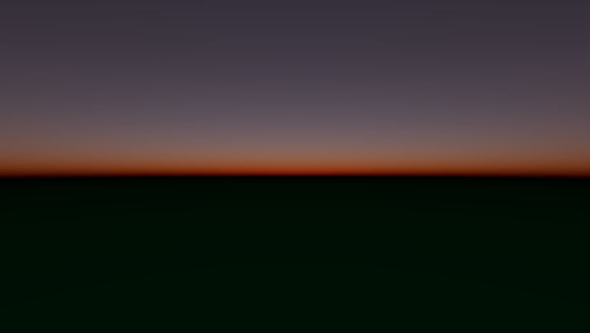

# Bevy experiments
Some experiments with the Bevy game engine in Rust.

## Examples

### Lava

Port of https://www.shadertoy.com/view/3sySRK to Bevy as a WGPU shader instead of GLSL.
Credit goes to `edankwan`.

### Boids

### Atmosphere

Port of https://www.shadertoy.com/view/wlBXWK to Bevy as a WGPU shader instead of GLSL.
Credit goes to `skythedragon`.
License: MIT

